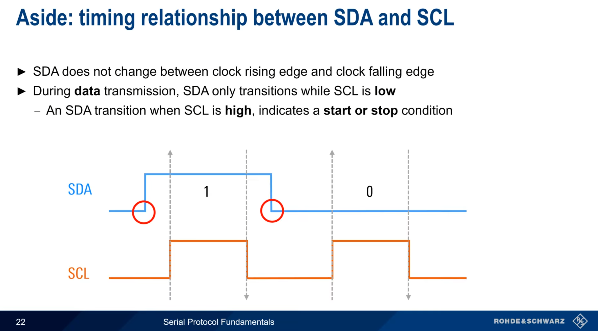

# I2C

## I2C Technical Specification & Architecture

I2C (Inter-Integrated Circuit) is a **half-duplex, synchronous, multi-controller, multi-target** serial communication protocol. It is designed for short-distance communication between integrated circuits on the same printed circuit board (PCB).

---

### 1. Physical Layer (PHY)

The physical medium consists of two open-drain bidirectional lines: **SDA** (Serial Data) and **SCL** (Serial Clock).

* **Open-Drain Configuration:** Devices can only pull the lines to Ground (Logic 0). They cannot drive the lines High (Logic 1).
* **Pull-up Resistors ($R_p$):** External resistors are required to pull the lines to $V_{DD}$ when all devices are in a high-impedance state.
* **Capacitive Loading:** The maximum number of devices on the bus is limited by the total bus capacitance ($400\text{ pF}$), which dictates the rise time of the signals.

---

### 2. Signal States & Bit Transfer

Logic levels are sampled only when the clock is stable.

* **Data Validity:** The SDA line must remain stable whenever SCL is **High**. SDA can only change state when SCL is **Low**.
* **Start Condition (S):** SDA transitions from High to Low while SCL is High.
* **Stop Condition (P):** SDA transitions from Low to High while SCL is High.
* **Repeated Start (Sr):** A Start condition generated without a preceding Stop; used to change direction or target without releasing the bus.

---

### 3. Protocol Frame Structure

Every communication sequence follows a strict 8-bit oriented format.

#### A. Address Frame

1. **Start Condition.**
2. **7-bit Address:** Unique identifier for the Target device.
3. **R/W Bit:** `0` for Write (Controller to Target), `1` for Read (Target to Controller).
4. **ACK/NACK Bit:** The 9th clock pulse. The receiver pulls SDA Low to acknowledge (ACK).

#### B. Data Frame

1. **8-bit Payload:** Data byte transmitted MSB (Most Significant Bit) first.
2. **ACK/NACK Bit:** Receiver confirms receipt.
3. **Stop Condition:** Finalizes the transaction.

---

### 4. Logic & Bus Arbitration

I2C supports multiple controllers through two distinct mechanisms:

* **Clock Synchronization:** If two controllers try to drive SCL, the clock period is determined by the device with the longest Low period.
* **Arbitration:** If two controllers transmit simultaneously, they monitor SDA. If a controller attempts to send a High but detects a Low (driven by another controller), it loses arbitration and switches to Target mode. **No data is lost** during this process.

---

### 5. Advanced Features

| Feature | Description |
| --- | --- |
| **Clock Stretching** | A Target holds SCL Low to pause the Controller if it needs more time to process data. |
| **10-bit Addressing** | Expands the address space by using two address bytes (header `11110XX`). |
| **General Call** | Address `0000000` allows a Controller to address all devices on the bus simultaneously. |

---

### 6. Standard Speed Modes

* **Standard-mode (Sm):** Up to $100\text{ kbit/s}$
* **Fast-mode (Fm):** Up to $400\text{ kbit/s}$
* **Fast-mode Plus (Fm+):** Up to $1\text{ Mbit/s}$
* **High-speed mode (Hs-mode):** Up to $3.4\text{ Mbit/s}$

Are you currently debugging a specific I2C hardware issue, or are you designing a new bus topology?

---

<a href="01_CAN.md">← 01_CAN.md</a>

<a href="04_SPI.md">04_SPI.md →</a>
