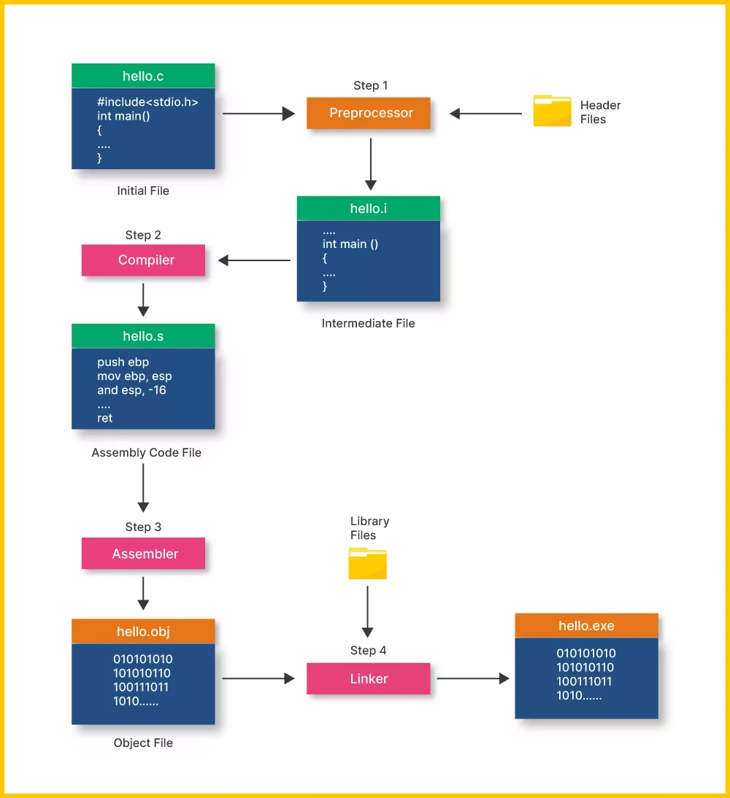

## Compilatoin Process

**GNU** : Gnu Not Unix  
**Make** : This is a tool that can - build executable programs and libs via makefile script.  
**Compiler Flags** : These can be used to show all the intermediate file during the compilation.

`CIS_OH` :

